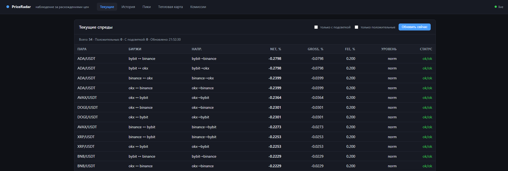
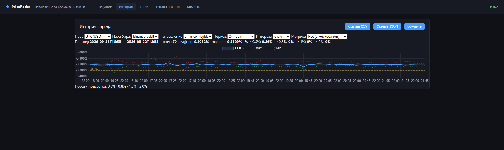
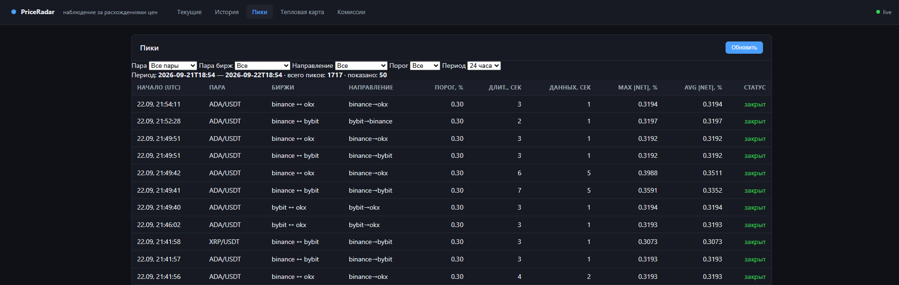
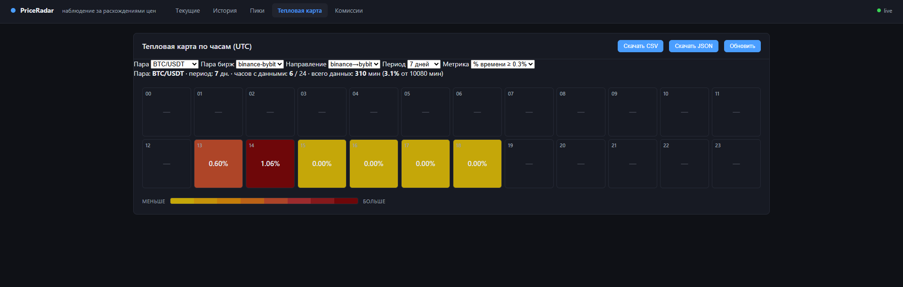
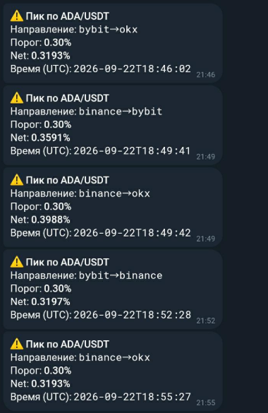
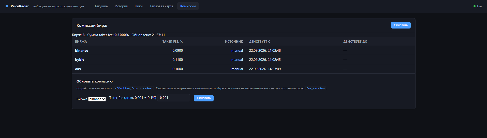

# PriceRadar

**Станция наблюдения за расхождениями цен между криптобиржами.**

Собирает bid/ask с трёх бирж (Binance, Bybit, OKX) через WebSocket, считает спреды с учётом taker-комиссий, хранит историю, находит пики и показывает закономерности: в какие часы и на каких парах биржи расходятся сильнее. Это не арбитражный бот — это инструмент наблюдения и анализа. Цель — увидеть не момент, а закономерность.

---

## Что показывает

### 1. Текущие спреды

Таблица всех 54 рядов (9 пар × 3 пары бирж × 2 направления) с обновлением раз в 5 секунд. Показывает `spread_net`, `spread_gross`, сумму комиссий, уровень подсветки по порогам и статус свежести данных по каждой бирже.



### 2. История спреда

Интерактивный график (Chart.js) с тремя линиями — Last, Max, Min — за выбранный период и интервал. Горизонтальные линии порогов (`0.3 / 0.5 / 1.0 / 1.5 / 2.0%`). Переключатель метрики **net / gross**. Экспорт в CSV / JSON.



### 3. Список пиков

Таблица отклонений `|spread_net|` выше порогов пиков (`0.3 / 0.5 / 1.0 / 2.0%`). Фильтры по паре, биржам, направлению, порогу и периоду. Пагинация. Открытые пики — красным, закрытые — зелёным.



### 4. Тепловая карта

24 ячейки по часам суток UTC. Метрика — `% времени ≥ 0.3%` (основная) или `средний |net|` (вторичная). Цвет — от жёлтого к тёмно-красному. Тултип по каждой ячейке: статистика по порогам, avg, max, минуты данных.



### 5. Telegram-уведомления

Уведомления при открытии пика с порогом ≥ настроенного. Cooldown — не чаще раза в N минут по каждому ряду.



### 6. Управление комиссиями

UI для обновления taker-комиссий бирж с версионированием: старая версия закрывается (`effective_to`), новая — открывается (`effective_from`). Прошлые агрегаты и пики сохраняют свою `fee_version`.



---

## Возможности

- **Сбор с 3 бирж** через WebSocket: Binance, Bybit, OKX.
- **9 торговых пар:** BTC, ETH, SOL, BNB, XRP, DOGE, ADA, AVAX, LINK (к USDT).
- **54 ряда:** 9 пар × 3 пары бирж × 2 направления (A→B и B→A — независимые ряды).
- **Учёт taker-комиссий:** `spread_net = spread_gross − fee_A − fee_B`.
- **Секундный ring buffer** в памяти: 54 буфера × 3600 точек (1 час).
- **Минутная агрегация** в PostgreSQL: min / max / avg_abs / avg_signed / last + счётчики `seconds_above_*`.
- **Детектор пиков** с гистерезисом 3 сек и паузой при пропусках.
- **Тепловая карта** по часам UTC.
- **Telegram-уведомления** при превышении порога.
- **Экспорт** в CSV / JSON.
- **Управление комиссиями** через UI с версионированием.
- **Версионирование порогов и комиссий** (`threshold_version`, `fee_version`) — старые данные не смешиваются с новыми.

---

## Архитектура

```
┌──────────┐  ┌──────────┐  ┌──────────┐
│ Binance  │  │  Bybit   │  │   OKX    │
└────┬─────┘  └────┬─────┘  └────┬─────┘
     │ WS          │ WS          │ WS
     └─────────────┼─────────────┘
                   ▼
         ┌──────────────────┐
         │     FastAPI      │
         │  ─ collectors    │  WebSocket → in-memory PriceStore
         │  ─ spread_engine │  расчёт gross / net
         │  ─ ring buffer   │  3600 точек × 54 ряда
         │  ─ aggregator    │  раз в минуту → БД
         │  ─ peak_detector │  открытие / закрытие пиков
         │  ─ notifier      │  Telegram при пороге
         └────────┬─────────┘
                  │
          ┌───────┴───────┐
          ▼               ▼
      ┌────────┐     ┌────────┐
      │   PG   │     │ Redis  │
      └────┬───┘     └────────┘
           │ REST API /api/v1/*
           ▼
      ┌──────────┐
      │ Laravel  │
      │ +Chart.js│
      └──────────┘
```

---

## Технологии

**Backend**
- Python 3.12, FastAPI, uvicorn
- SQLAlchemy 2.0 (async), PostgreSQL 16
- Redis 7
- loguru (логирование), httpx (Telegram), websockets

**Frontend**
- Laravel 13, PHP 8.4
- Blade, vanilla JS
- Chart.js 4

**Инфраструктура**
- Docker Compose (5 сервисов)
- nginx + php-fpm

---

## Как запустить

### Требования

- **Docker Desktop** — [скачать](https://www.docker.com/products/docker-desktop/)
- **Git** — [скачать](https://git-scm.com/downloads)
- Свободные порты: `8010` (backend), `8020` (frontend), `5432` (PostgreSQL), `6379` (Redis)

**Проверка версий:**

```bash
docker --version
docker compose version
git --version
```

Должны вывестись версии. Если `command not found` — установите и **запустите Docker Desktop** (иконка в трее должна быть активна).

### Шаги

```bash
# 1. Клонировать репозиторий
git clone https://github.com/ditlate0-spec/priceradar.git
cd priceradar

# 2. Скопировать конфиги
cp .env.example .env
cp frontend/.env.example frontend/.env

# 3. Запустить стек (первый раз — 5–10 минут на сборку образов)
docker compose up -d

# 4. Сгенерировать APP_KEY для Laravel
docker compose exec frontend php artisan key:generate

# 5. Открыть в браузере
# UI:           http://localhost:8020
# API Swagger:  http://localhost:8010/docs
# Health:       http://localhost:8010/api/v1/health
```

**Для Windows PowerShell** — те же команды, но `cp` заменяется на `copy`:

```powershell
copy .env.example .env
copy frontend\.env.example frontend\.env
```

**Первые данные** появятся в UI через ~5 минут (нужно наполнить ring buffer 300 точками).

**Полная тепловая карта** — через 24 часа (нужны сутки истории).

### Проверка после запуска

```bash
# Контейнеры должны быть в статусе Up
docker compose ps

# Ожидаемо: 5 сервисов — db, redis, backend, frontend, frontend-nginx

# Backend отвечает
curl http://localhost:8010/api/v1/health
```

### Остановка

```bash
docker compose down       # остановить
docker compose down -v    # остановить и удалить данные PostgreSQL
```

### Просмотр логов

```bash
docker compose logs backend --tail=50 --follow      # backend
docker compose logs frontend --tail=50 --follow     # Laravel/php-fpm
docker compose logs frontend-nginx --tail=50        # nginx
```

### Перезапуск после правок

| Что менялось | Команда |
|---|---|
| Python-код backend | `docker compose restart backend` |
| Blade-шаблон / JS frontend | просто обновить страницу (**Ctrl+F5**) |
| `.env` | `docker compose up -d --force-recreate backend` |
| `docker-compose.yml` | `docker compose up -d --force-recreate` |
| `Dockerfile` | `docker compose build <service> && docker compose up -d <service>` |

**Важно:** `docker compose restart` **не перечитывает** `.env`. Для применения изменений в конфиге — только `up -d --force-recreate`.

---

## Как это работает

### Расчёт спреда

Для пары бирж (A, B) и направления A→B:

```
spread_gross(A→B) = (bid_A − ask_B) / ask_B × 100%
spread_net(A→B)   = spread_gross(A→B) − fee_A − fee_B
```

- `bid_A` — лучшая цена покупки на бирже A.
- `ask_B` — лучшая цена продажи на бирже B.
- `fee_A`, `fee_B` — taker-комиссии бирж (в %).

**Основная метрика** — `spread_net`. Все пороги, подсветка, пики и статистика считаются по ней.

**Пример.** BTC/USDT, bybit→binance:
- `bid_bybit = 63000`, `ask_binance = 63030`
- `spread_gross = (63000 − 63030) / 63030 × 100% = −0.0476%`
- Комиссии: `0.1% + 0.1% = 0.2%`
- `spread_net = −0.0476 − 0.2 = −0.2476%`

### Пороги

| Назначение | Значения | Где применяется |
|---|---|---|
| Подсветка | `0.3 / 0.8 / 1.5 / 2.0 %` | цвет ячейки в UI |
| Пики и счётчики | `0.3 / 0.5 / 1.0 / 2.0 %` | открытие/закрытие пиков, `seconds_above_*` |

**Два независимых множества.** Подсветка «кричит» реже, пики фиксируют тонкие события. Это осознанное решение: `0.8%` — уже оранжевый в UI, но `0.5%` — уже пик.

Уровни подсветки:

| Уровень | Условие | Цвет |
|---|---|---|
| Норма | `|net| < 0.3%` | без подсветки |
| Заметно | `0.3 ≤ |net| < 0.8` | жёлтый |
| Существенно | `0.8 ≤ |net| < 1.5` | оранжевый |
| Сильно | `1.5 ≤ |net| < 2.0` | красный |
| Экстремально | `|net| ≥ 2.0` | тёмно-красный |

### Stale-статусы

| Условие | Статус | Поведение |
|---|---|---|
| Данные < 5 сек | `ok` | нормальная работа |
| 5–30 сек | `stale` | спред считается, но помечается |
| > 30 сек | `unavailable` | спред не считается, агрегат не пишется |

### Детектор пиков

- **Открытие:** `|spread_net| ≥ порог` впервые.
- **Закрытие:** `|spread_net| < порог` **3 секунды подряд** (гистерезис).
- **Пауза:** при пропуске данных пик помечается `is_paused = true`, гистерезис не отсчитывается до возобновления данных.
- **Пороги независимы:** пик `1.0%` и пик `2.0%` — разные записи. Пик по `0.3%` может быть закрыт, пока пик по `1.0%` остаётся открытым.

**`duration_data_seconds`** — секунды, когда спред был **выше порога** (не считая секунд гистерезиса).
**`duration_seconds`** — календарная длительность, включая секунды гистерезиса.

### Версионирование

- **`threshold_version`** — при смене порогов (`thresholds_v1` → `thresholds_v2`) старые агрегаты не смешиваются с новыми.
- **`fee_version`** — при смене комиссий аналогично. Формат: `fees_<YYYY_MM>_<YYYY_MM>`.

### Секундный буфер

- 54 буфера (по одному на ряд).
- Каждый на 3600 точек (1 час).
- Хранит `spread_net` и `spread_gross` с меткой времени.
- **In-memory**, в БД не пишется.
- **Теряется при рестарте** — восстанавливается из минутных агрегатов с потерей секундной детализации.
- Первые **5 минут** (300 точек) — «разогрев»: секундная подсветка и детектор пиков отключены, `/health` возвращает `buffer_ready: false`.

### Минутная агрегация

Раз в минуту по каждому ряду:

- `spread_min`, `spread_max` — по знаку.
- `spread_avg_abs` — среднее по модулю.
- `spread_avg_signed` — среднее по знаку.
- `spread_last` — последнее значение.
- `seconds_above_03 / 05 / 10 / 20` — секунды, когда `|spread_net|` был выше порога.
- `sample_count` — сколько секундных точек попало в минуту (норма 60).
- `partial` — `true`, если `sample_count < 60`.
- `stale_level` — `ok` / `stale` / `unavailable`.

Запись — **батчем раз в минуту**. Это снижает нагрузку на БД в 60 раз по сравнению с сырыми тиками.

---

## API

Все эндпоинты — с префиксом `/api/v1/`. Полная документация — `http://localhost:8010/docs`.

| Метод | Эндпоинт | Описание |
|---|---|---|
| GET | `/health` | Состояние сервисов, буферов, версии |
| GET | `/spreads/current` | Текущие цены и спреды (54 ряда) |
| GET | `/spreads/history` | История минутных агрегатов |
| GET | `/peaks` | Список пиков с фильтрами |
| GET | `/heatmap` | Тепловая карта по часам UTC |
| GET | `/fees` | Активные комиссии бирж |
| POST | `/fees` | Обновить комиссию (новая версия) |
| GET | `/export` | Экспорт агрегатов в CSV / JSON |

### Параметры основных эндпоинтов

**`GET /spreads/history`**
- `pair` — обязательно, например `BTC/USDT`
- `exchange_pair` — обязательно, `binance-bybit` / `binance-okx` / `bybit-okx`
- `direction` — обязательно, `binance-bybit` (через дефис)
- `from`, `to` — ISO 8601 UTC, по умолчанию — 24 часа
- `interval` — `1m` (по умолчанию) / `5m` / `15m` / `1h` / `1d`
- `metric` — `net` / `gross`

**`GET /peaks`**
- `pair`, `exchange_pair`, `direction` — опционально
- `threshold` — `0.3` / `0.5` / `1.0` / `2.0`
- `from`, `to` — ISO 8601 UTC
- `limit`, `offset` — пагинация

**`GET /heatmap`**
- `pair`, `exchange_pair`, `direction` — обязательно
- `days` — за сколько дней (по умолчанию 7, максимум 90)
- `tz` — `utc` (по умолчанию) / `local`
- `metric` — `pct_above_03` / `avg_spread`

**`GET /export`**
- `pair`, `exchange_pair`, `direction` — обязательно
- `from`, `to` — ISO 8601 UTC
- `format` — `csv` / `json`
- `metric` — `net` / `gross` / `both`

### Примеры

```bash
# Текущие спреды
curl "http://localhost:8010/api/v1/spreads/current"

# История BTC/USDT, binance→okx, 24 часа, 5-минутный интервал
curl "http://localhost:8010/api/v1/spreads/history?pair=BTC/USDT&exchange_pair=binance-okx&direction=binance-okx&interval=5m"

# Пики выше 0.5% за 7 дней
curl "http://localhost:8010/api/v1/peaks?threshold=0.5&from=2026-09-15T00:00:00Z"

# Тепловая карта BTC/USDT binance→okx за 7 дней
curl "http://localhost:8010/api/v1/heatmap?pair=BTC/USDT&exchange_pair=binance-okx&direction=binance-okx&days=7"

# Экспорт в CSV
curl -O "http://localhost:8010/api/v1/export?pair=BTC/USDT&exchange_pair=binance-okx&direction=binance-okx&format=csv"
```

---

## Telegram-уведомления

Уведомления приходят, когда детектор пиков открывает пик с порогом `≥ TELEGRAM_MIN_THRESHOLD`.

**Настройка:**

1. **Создайте бота** через `@BotFather` в Telegram → получите токен.
2. **Узнайте свой `chat_id`** через `@userinfobot`.
3. **Отправьте боту `/start`** — иначе Telegram не разрешит ему писать вам.
4. **Добавьте в `.env`:**

   ```
   TELEGRAM_BOT_TOKEN=<токен>
   TELEGRAM_CHAT_ID=<chat_id>
   TELEGRAM_ENABLED=true
   TELEGRAM_MIN_THRESHOLD=0.5
   TELEGRAM_COOLDOWN_MINUTES=5
   ```

5. **Пересоздайте контейнер:**

   ```bash
   docker compose up -d --force-recreate backend
   ```

6. **Проверьте:**

   ```bash
   docker compose exec backend python -c "import asyncio; from app.core.notifier import send_test; asyncio.run(send_test())"
   ```

**Cooldown:** после отправки уведомления по ряду — следующее не раньше, чем через `TELEGRAM_COOLDOWN_MINUTES` минут. Защита от спама при частых пиках на одном ряду.

**Формат сообщения:**

```
⚠️ Пик по ADA/USDT
Направление: binance→okx
Порог: 0.50%
Net: 0.5204%
Время (UTC): 2026-09-22 17:50:23
```

**Что НЕ отправляется:** закрытие пика, изменение спреда, изменение комиссий. Только открытие — по ТЗ, «простые уведомления без событий и эскалации».

---

## Ограничения

**Что НЕ сделано и почему:**

- **Автоподтяжка комиссий с бирж.** У Binance, Bybit, OKX **нет публичных эндпоинтов комиссий** — все требуют signed request с API-ключом пользователя. Реализовано **ручное обновление через UI** с версионированием через `effective_from`. 

- **WebSocket от backend к frontend.** Сейчас polling раз в 5 секунд. Достаточно для наблюдения; WS — план на следующую итерацию.

- **Rate limiting.** Не реализован. Для локального запуска не критично. В production — обязателен (REST 60 req/min на IP, WS 4 соединения на IP).

**Осознанные решения:**

- **Пороги фиксированные, не адаптивные.** Калибровка — план на будущее.
- **`fee_version` — месячная гранулярность.** Меняется раз в месяц. Достаточно для сопоставимости.
- **Секундный буфер теряется при рестарте.** Восстанавливается из минутных агрегатов с потерей секундной детализации.
- **Все метки времени — UTC.** Тепловая карта — UTC. Переключатель на локальный пояс — план.

---

## Структура проекта

```
priceradar/
├── backend/                        # FastAPI
│   ├── app/
│   │   ├── api/                    # REST эндпоинты
│   │   │   ├── spreads.py          # /spreads/current
│   │   │   ├── history.py          # /spreads/history
│   │   │   ├── peaks.py            # /peaks
│   │   │   ├── heatmap.py          # /heatmap
│   │   │   ├── fees.py             # /fees
│   │   │   └── export.py           # /export
│   │   ├── collectors/             # WebSocket к биржам
│   │   │   ├── base.py
│   │   │   ├── binance.py
│   │   │   ├── bybit.py
│   │   │   ├── okx.py
│   │   │   └── manager.py
│   │   ├── core/                   # ядро
│   │   │   ├── config.py           # настройки из .env
│   │   │   ├── database.py         # SQLAlchemy
│   │   │   ├── ring_buffer.py      # секундный буфер
│   │   │   ├── buffer_manager.py   # 54 буфера
│   │   │   ├── spread_engine.py    # расчёт спредов
│   │   │   ├── tick_processor.py   # пересчёт раз в секунду
│   │   │   ├── aggregator.py       # минутная агрегация
│   │   │   ├── peak_detector.py    # детектор пиков
│   │   │   ├── notifier.py         # Telegram
│   │   │   └── fees.py             # fee_version
│   │   ├── models/                 # SQLAlchemy-модели
│   │   │   ├── exchange_fees.py
│   │   │   ├── spread_aggregates.py
│   │   │   ├── skipped_minutes.py
│   │   │   └── peaks.py
│   │   └── main.py                 # FastAPI + lifespan
│   ├── scripts/                    # диагностические скрипты
│   │   ├── check_aggregates.py
│   │   ├── check_peaks.py
│   │   └── check_gross.py
│   ├── requirements.txt
│   └── Dockerfile
│
├── frontend/                       # Laravel + Chart.js
│   ├── app/Http/Controllers/
│   │   ├── SpreadsController.php
│   │   ├── PeaksController.php
│   │   ├── HeatmapController.php
│   │   └── FeesController.php
│   ├── resources/views/
│   │   ├── layouts/app.blade.php
│   │   ├── spreads/index.blade.php
│   │   ├── spreads/history.blade.php
│   │   ├── peaks/index.blade.php
│   │   ├── heatmap/index.blade.php
│   │   └── fees/index.blade.php
│   ├── public/
│   │   ├── css/spreads.css
│   │   └── js/
│   │       ├── spreads.js
│   │       ├── history.js
│   │       ├── peaks.js
│   │       ├── heatmap.js
│   │       └── fees.js
│   ├── routes/web.php
│   ├── docker/nginx/default.conf
│   ├── Dockerfile
│   └── .env.example
│
├── docs/screenshots/               # скриншоты для README
│   ├── 01-current.png
│   ├── 02-history.png
│   ├── 03-peaks.png
│   ├── 04-heatmap.png
│   ├── 05-telegram.png
│   └── 06-fees.png
│
├── docker-compose.yml              # 5 сервисов
├── .env.example                    # пример конфига backend
├── .gitignore
├── LICENSE
└── README.md
```

---


## Автор

- GitHub: [@ditlate0-spec](https://github.com/ditlate0-spec)
- Instagram: [@prod_23b](https://www.instagram.com/prod_23b/)

## Лицензия

Проект распространяется под лицензией **Creative Commons Attribution-NonCommercial 4.0 International (CC BY-NC 4.0)**.

**Вы можете:**
- Делиться — копировать и распространять материал на любом носителе и в любом формате.
- Адаптировать — делать ремиксы, преобразовывать и дополнять материал.

**При условиях:**
- **Attribution** — указывать авторство, давать ссылку на лицензию и указывать, были ли внесены изменения.
- **NonCommercial** — **запрещено коммерческое использование**.
- **No additional restrictions** — нельзя применять юридические или технологические ограничения, запрещающие другим делать то, что разрешает лицензия [citation:3][citation:8].

**Полный текст лицензии:** https://creativecommons.org/licenses/by-nc/4.0/legalcode

**Человекочитаемое описание:** https://creativecommons.org/licenses/by-nc/4.0/